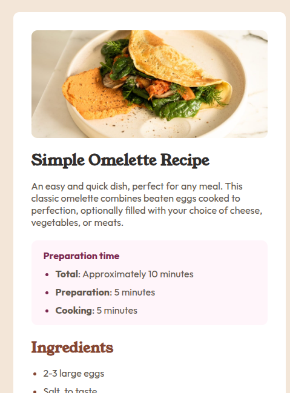

# recipe-page

# 🍽️ Frontend Mentor - Recipe Page Solution

This is my solution to the [Recipe Page Challenge on Frontend Mentor](https://www.frontendmentor.io/challenges/recipe-page-KiTsR8QQKm). Frontend Mentor challenges help improve coding skills by building real-world projects.

---

## 📌 Table of Contents

- [Overview](#overview)
  - [Screenshot](#screenshot)
  - [Links](#links)
- [My Process](#my-process)
  - [Built With](#built-with)
  - [What I Learned](#what-i-learned)
  - [Continued Development](#continued-development)
  - [Useful Resources](#useful-resources)
- [Author](#author)
- [Acknowledgments](#acknowledgments)

---

## 🌟 Overview

### 🖼️ Screenshot



### 🔗 Links

- Solution URL: [View my solution](https://your-solution-url.com)
- Live Site URL: [Check it out live](https://your-live-site-url.com)

---

## 🔨 My Process

### 🛠️ Built With

- Semantic **HTML5** markup
- **CSS** custom properties
- **Flexbox** & **CSS Grid**
- **Mobile-first** workflow

### 💡 What I Learned

Working on this project improved my understanding of:

- Structuring semantic HTML properly for better accessibility.
- Implementing responsive layouts using **CSS Grid** and **Flexbox**.

Here’s a snippet of code I’m proud of:

```css
.card{
    width: 450px;
    height: auto;
    padding: 30px;
    margin: 50px auto;
    background: hsl(0, 0%, 100%);
    color: hsl(30, 10%, 34%);
    border-radius: 10px;
}
```

This helped me create a clean and efficient layout for the recipe page!

### 🚀 Continued Development

I plan to continue improving by:

- Deepening my understanding of **CSS animations and transitions**.
- Exploring **advanced accessibility techniques**.
- Enhancing my **JavaScript interactivity** skills for future projects.

### 📚 Useful Resources

- [CSS Grid Guide](https://css-tricks.com/snippets/css/complete-guide-grid/) - A complete guide that helped me structure my layout effectively.

---

## 👤 Author

- Github - [Michael-Okorie](https://github.com/Michael-Okorie)
- Frontend Mentor - [@Michael-Okorie](https://www.frontendmentor.io/profile/Michael-Okorie)
- Twitter - [@Dev_Michael_](https://www.twitter.com/Dev_Michael_)

---

## 🎉 Acknowledgments

Big thanks to **Frontend Mentor** for providing this challenge and to the awesome developer community for inspiration and guidance!

---

🔹 **Happy Coding!** 🚀

